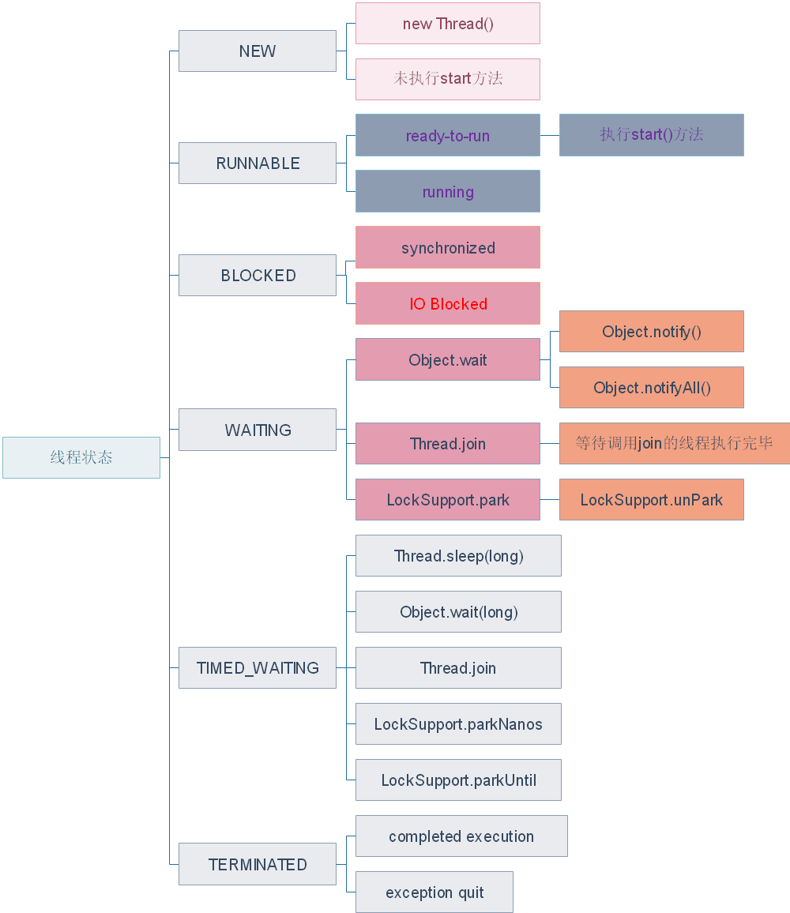

#### NEW

      Thread state for a thread which has not yet started.  
      线程还未开始执行，线程初始化状态

--------------

#### RUNNABLE

      Thread state for a runnable thread.  A thread in the runnablestate is executing 
      in the Java virtual machine but it may be waiting for other resources from the 
      operating system such as processor.
      正在运行的线程，在虚拟机中正在执行的线程状态，但是可能正在等待操作系统的调度。

--------------

##### BLOCKED

       Thread state for a thread blocked waiting for a monitor lock.
       A thread in the blocked state is waiting for a monitor lock to enter a synchronized 
       block/method or  reenter a synchronized block/method after calling
       {@link Object#wait() Object.wait}.
       阻塞的线程，等待获取监视器所。阻塞线程等待获取监视器锁，调用wait()后，进入一个同步代码块或者方法，
       或者重入另外一个同步代码块或者方法

--------------

##### WAITING

      Thread state for a waiting thread.
      A thread is in the waiting state due to calling one of the
      following methods:
      <ul>
        <li>{@link Object#wait() Object.wait} with no timeout</li>
        <li>{@link #join() Thread.join} with no timeout</li>
        <li>{@link LockSupport#park() LockSupport.park}</li>
      </ul>
    
      
A thread in the waiting state is waiting for another thread to
      perform a particular action.
    
      For example, a thread that has called <tt>Object.wait()</tt>
      on an object is waiting for another thread to call
      <tt>Object.notify()</tt> or <tt>Object.notifyAll()</tt> on
      that object. A thread that has called <tt>Thread.join()</tt>
      is waiting for a specified thread to terminate.
    
      调用一下方法后线程一直处理等待[<ul>标签]，直到通过下面的方法进行释放后[<tt>标签]，线程才可以继续执行

--------------

##### TIMED_WAITING

      Thread state for a waiting thread with a specified waiting time.
      A thread is in the timed waiting state due to calling one of
      the following methods with a specified positive waiting time:
      <ul>
        <li>{@link #sleep Thread.sleep}</li>
        <li>{@link Object#wait(long) Object.wait} with timeout</li>
        <li>{@link #join(long) Thread.join} with timeout</li>
        <li>{@link LockSupport#parkNanos LockSupport.parkNanos}</li>
        <li>{@link LockSupport#parkUntil LockSupport.parkUntil}</li>
      </ul>
      线程等待固定的时间，显示调用以下方法后，线程会根据传入时间进行等待，直到到达需要等待的时间，

--------------

#### TERMINATED

      Thread state for a terminated thread.The thread has completed execution.
      线程终态，线程已经远行完毕。[正常执行完毕][异常情况退出]

####对象头      
      https://www.cnblogs.com/LemonFive/p/11246086.html  
      https://www.jianshu.com/p/f9436f605299 大小端  
      所谓的大小端就是指字节序在内存中是如何存储的。大端指的就是把字节序的尾端（0xcd）放在高内存地址，
      而小端指的就是把字节序的尾端（0xcd）放在低内存地址，所以正确的叫法应该是高尾端和低尾端。
      https://www.cnblogs.com/Alandre/p/4878841.html  

      |--------------------------------------------------------------------------------------------------------------------------------------------|  
      |                                              Object Header (128 bits)                                                                      |  
      |--------------------------------------------------------------------------------------------------------------------------------------------|  
      |                        Mark Word (64 bits)                                                                  |      Klass Word (64 bits)    |          
      |--------------------------------------------------------------------------------------------------------------------------------------------|  
      |  unused:25 | 对象标识Hash码，采用延迟加载技术 | unused:1 | Java GC标记位对象年龄  | 偏向锁标记      | 锁状态标记位 |     OOP to metadata object   |  无锁  
      |  unused:25 | identity_hashcode:31          | unused:1 | age:4                | biased_lock:1  | lock:2      |     OOP to metadata object   |  无锁  
      |-----------------------------------------------------------------------------------------------|-------------|------------------------------|  
      |  thread:54 |         epoch:2      | unused:1 | age:4 | biased_lock:1                          | lock:2      |     OOP to metadata object   |  偏向锁  
      |-----------------------------------------------------------------------------------------------|-------------|------------------------------|  
      |                     ptr_to_lock_record:62                                                     | lock:2      |     OOP to metadata object   |  轻量锁  
      |-----------------------------------------------------------------------------------------------|-------------|------------------------------|  
      |                     ptr_to_heavyweight_monitor:62                                             | lock:2      |     OOP to metadata object   |  重量锁  
      |-----------------------------------------------------------------------------------------------|-------------|------------------------------|  
      |                                                                                               | lock:2      |     OOP to metadata object   |    GC  
      |--------------------------------------------------------------------------------------------------------------------------------------------|        

